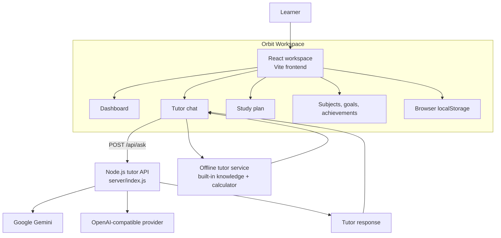
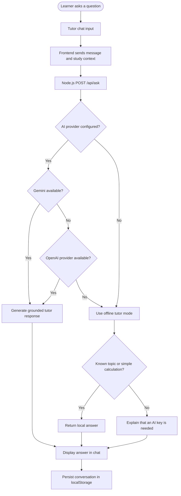

# Orbit Study Tutor

Orbit is a focused AI study companion that helps learners turn large study goals into clear next steps. It combines a personal tutor chat, study planning, subject tracking, quick quizzes, goals, achievements, and progress insights in one responsive workspace.

## Why Orbit?

Many study tools either show static content or provide a chat window without meaningful context. Orbit connects both sides: learners can ask questions, plan their next session, track progress, and use short recall activities without leaving the workspace.

## Features

- **AI tutor chat** - Ask questions, request explanations, create a study plan, or test your understanding.
- **Offline tutor mode** - Built-in answers for selected study topics and safe basic calculations work without an API key.
- **Personal dashboard** - View weekly progress, study streaks, completed sessions, and the next recommended lesson.
- **Study plan** - Add sessions, choose days, set durations, and mark sessions as complete.
- **Subject library** - Add subjects and track progress across Biology, Mathematics, History, and custom topics.
- **Quick quizzes** - Practice active recall with short lesson-based question sets.
- **Goals and achievements** - Track milestones such as study hours, subject completion, and consistency.
- **Local persistence** - Messages, plans, streaks, subjects, and progress persist in the browser using `localStorage`.
- **Responsive interface** - Designed for desktop and mobile study sessions.

## Tech stack

- React and React DOM
- Vite
- Lucide React icons
- Node.js HTTP API
- Gemini or OpenAI-compatible AI providers
- Plain CSS with responsive layouts

## System architecture



## Tutor question workflow



## Project structure

```text
study-tutor-project/
|-- server/
|   `-- index.js              AI provider API server
|-- src/
|   |-- services/tutorAgent.js Offline tutor and quiz logic
|   |-- main.jsx               React application and pages
|   |-- style.css              Core visual styles
|   |-- study-plan.css         Study plan styles
|   `-- workspace-pages.css    Workspace page styles
|-- .env.example               AI provider configuration template
|-- package.json                Scripts and dependencies
`-- vite.config.js              Vite configuration
```

## Run locally

Requirements: Node.js 18 or newer.

```bash
npm install
npm run dev:full
```

Open [http://localhost:5173](http://localhost:5173). The `dev:full` command starts both the Vite frontend and the local tutor API on port `8787`.

## Connect a real AI provider

Copy `.env.example` to `.env` and configure one provider:

```env
GEMINI_API_KEY=your_gemini_api_key
GEMINI_MODEL=gemini-2.0-flash
```

Or use an OpenAI-compatible provider:

```env
OPENAI_API_KEY=your_openai_api_key
OPENAI_MODEL=gpt-4o-mini
OPENAI_BASE_URL=https://api.openai.com/v1
```

Restart the server after changing `.env`. Keep `.env` private; it is excluded by `.gitignore`. Without a provider key, Orbit stays usable in offline demo mode, but a real model is required for arbitrary questions.

## API

The local server exposes one tutor endpoint:

```text
POST /api/ask
```

Example request:

```json
{
	"message": "Explain cellular respiration simply",
	"context": {
		"streak": 7,
		"completed": 12
	}
}
```

The server sends the request to the configured provider and returns a tutor response. The frontend automatically falls back to offline mode when no provider is configured or temporarily unavailable.

## Production build

```bash
npm run build
npm run preview
```

The production files are generated in `dist/`. For deployment, host the Vite frontend and the `server/` API separately, then configure the frontend API route for the deployed server.

## Available scripts

| Command | Purpose |
| --- | --- |
| `npm run dev` | Start the Vite frontend |
| `npm run server` | Start the tutor API server |
| `npm run dev:full` | Start frontend and API together |
| `npm run build` | Create a production build |
| `npm run preview` | Preview the production build |
